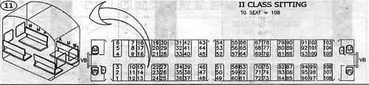

# [Seating Arrangement](https://www.hackerearth.com/practice/basic-programming/input-output/basics-of-input-output/practice-problems/algorithm/seating-arrangement-1/)

**Difficulty: Very easy**

Akash and Vishal are quite fond of travelling. They mostly travel by railways. They were travelling on a train one day and they got interested in the seating arrangement of their compartment. The compartment looked something like this:

They got interested to know the seat number facing them and the seat type facing them. The seats are denoted as follows :

+ Window Seat &mdash; *WS*
+ Middle Seat &mdash; *MS*
+ Aisle Seat &mdash; *AS*

You will be given a seat number, find out the seat number facing you and the seat type, i.e. *WS*, *MS* or *AS*.

## Input

First line of input will consist of a single integer *T* denoting number of test-cases. Each test-case consists of a single integer *N* denoting the seat-number.

## Output

For each test case, print the facing seat-number and the seat-type, separated by a single space in a new line.

## Constraints

+ 1 &le; T &le; 105
+ 1 &le; N &le; 108

## Sample

<table>
	<tr>
		<th width="500">Input</th>
		<th width="500">Output</th>
	</tr>
	<tr>
		<td valign="top">
			2 
			18 
			40
		</td>
		<td valign="top">
			19 WS 
			45 AS
		</td>
	</tr>
</table>
